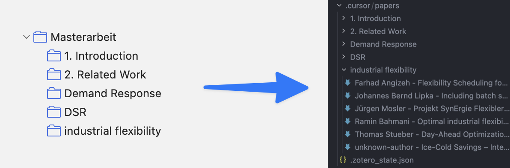

# zotero-to-md

<p align="center">
  
</p>


CLI tool to sync Zotero entries from a chosen root collection to Markdown files in a configurable destination directory.

## Features

- Hybrid sync for a chosen Zotero root collection recursively (including subfolders)
- Extract content from attached PDFs and URL-only entries
- Mirror Zotero folder structure into your configured destination directory
- Save files as `<author> - <title>.md`
- Stateful sync with retries for failed items and reprocessing for changed Zotero metadata
- Includes maintenance commands for status inspection, canonical resync, and stale file pruning

## Setup

1. Install dependencies:

```bash
uv sync
```

2. Create a `.env` file:

```bash
cp .env.example .env
```

3. Fill in Zotero credentials:

```env
ZOTERO_API_KEY=...
ZOTERO_USER_ID=...
```

## Quickstart

Run the normal sync command:

```bash
uv run zotero-to-md sync \
  --root-collection "Masterarbeit" \
  --target-destination-path /absolute/path/to/output
```

This is the main command. It syncs the selected Zotero root collection into Markdown files below your output directory.

Output is written only to:

```text
/absolute/path/to/output/
```

State file:

```text
/absolute/path/to/output/.zotero_state.json
```

## Common options

Use these with `sync` when needed:

- `--recursive/--no-recursive` (default: recursive)
- `--dry-run` to preview what would be processed without writing files or state
- `--verbose` to print per-item logs

Example:

```bash
uv run zotero-to-md sync \
  --root-collection "Masterarbeit" \
  --target-destination-path /absolute/path/to/output \
  --dry-run
```

## Maintenance commands

Most users only need `sync`. The commands below are for inspection and cleanup.

### status

Inspect the current sync state:

```bash
uv run zotero-to-md status \
  --root-collection "Masterarbeit" \
  --target-destination-path /absolute/path/to/output
```

This shows how many items are:

- `new`
- `changed`
- `errored`
- `stale`
- `ok`

### resync

Force a canonical rewrite and rename for one item or all items.

Resync one item:

```bash
uv run zotero-to-md resync \
  --root-collection "Masterarbeit" \
  --target-destination-path /absolute/path/to/output \
  --item-key ABCD1234
```

Resync everything below the selected root collection:

```bash
uv run zotero-to-md resync \
  --root-collection "Masterarbeit" \
  --target-destination-path /absolute/path/to/output \
  --all
```

`sync` keeps existing file paths stable by default. Use `resync` when you want files renamed or moved to the current canonical Zotero-derived path.

### prune

Show stale files or delete them.

Preview stale files:

```bash
uv run zotero-to-md prune \
  --root-collection "Masterarbeit" \
  --target-destination-path /absolute/path/to/output
```

Delete stale files and remove their state entries:

```bash
uv run zotero-to-md prune \
  --root-collection "Masterarbeit" \
  --target-destination-path /absolute/path/to/output \
  --apply
```
